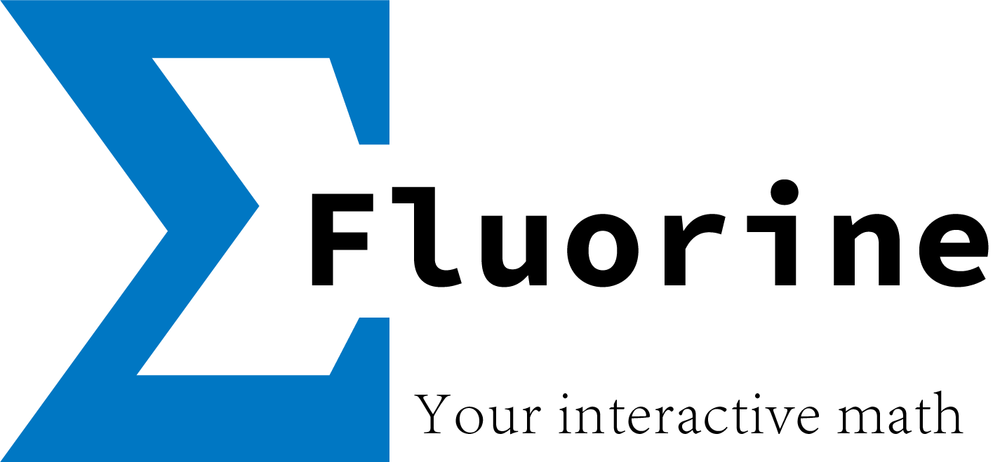

fluorine-rs
============

A functional programming language with my personal preference.

## Features
- Trait-based OO
- Generic Types
- Pattern matching
- Rust-like enums
- Optional type hints
- Operator overloading via traits
- Easy-to-use FFI macros

## Examples
- Pattern matching
```fluorine
enum Expr {
    Add(Expr, Expr),
    Sub(Expr, Expr),
    Mul(Expr, Expr),
    Div(Expr, Expr),
    Lit(Number),
}

let eval = { expr ->
    match expr {
        Add(l, r) => eval(l) + eval(r),
        Sub(l, r) => eval(l) - eval(r),
        Mul(l, r) => eval(l) * eval(r),
        Div(l, r) => eval(l) / eval(r),
        Lit(n)    => n,
    }
}

// (1 + 8) * 10
let tree = Mul(Add(Lit(1), Lit(8)), Lit(10))

// 90
println(eval(tree))
```

- Traits and Impl
```fluorine
enum Data {
    EmptyData,
}

trait Greet {
    let greeting: (self, name: String) -> Unit
}

trait Call {
    let call: (self, unit: Unit) -> Unit
}

impl Greet for Data {
    let greeting = { self, name -> println("hello " + name) }
}

impl<T: Greet> Call for T {
    let call = { self, _ -> self.greeting("fluorine") }
}

let data = EmptyData();
// hello fluorine
data.call(());
```

- FFI macros
```rust
#[fluorine(Prelude)]
mod prelude_ffi {
    use crate::ffi::*;
    
    #[fluorine]
    fn hello(name: String) {
        println!("hello {}", name);
    }
}
```

and in fluorine, just do:
```fluorine
Fs> hello("jobs")
hello jobs
```

## Acknowledge

We would like to thank [JetBrains](https://www.jetbrains.com/?from=mozart++) for sharing free
open-source licences of amazing tools such as [CLion](https://www.jetbrains.com/idea/?from=mozart++).

[](https://www.jetbrains.com/?from=mozart++)

